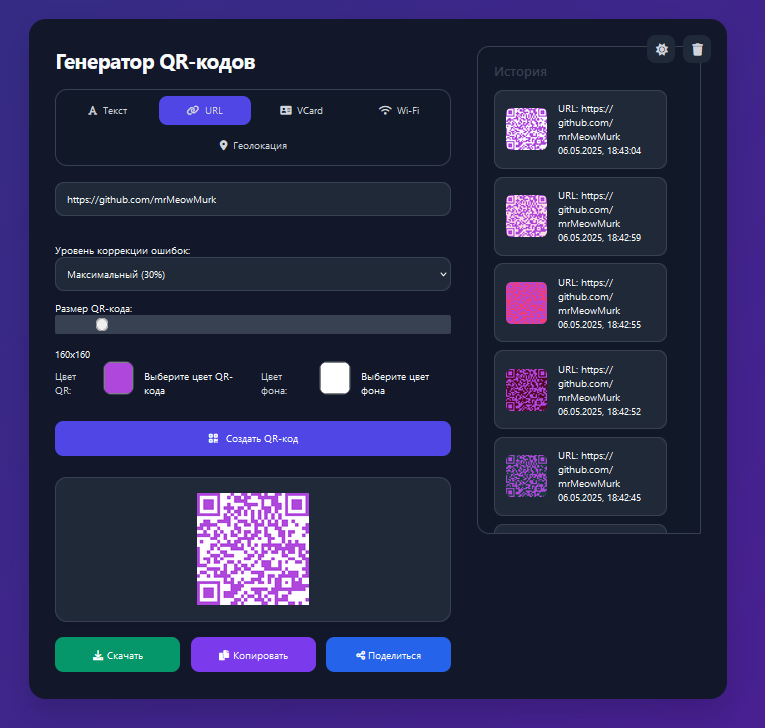

# 🎯 QR Code Generator | Генератор QR-кодов



## 📝 Описание

Современный и удобный веб-генератор QR-кодов с расширенными возможностями настройки. Создавайте QR-коды для различных типов данных с красивым интерфейсом и дополнительными функциями.

### ✨ Основные возможности

- 🎨 Современный и адаптивный дизайн
- 🌓 Темная и светлая темы
- 📱 Поддержка мобильных устройств
- 🔄 История генерации
- 💾 Локальное сохранение настроек

### 🎁 Типы поддерживаемых QR-кодов

- 📝 Текст
- 🔗 URL-ссылки
- 📇 VCard (визитные карточки)
- 📶 Wi-Fi конфигурации
- 📍 Геолокация

## 🛠️ Настройка QR-кода

- 🎨 Настраиваемые цвета QR-кода и фона
- 📏 Регулируемый размер (128x128 - 512x512)
- 🛡️ Выбор уровня коррекции ошибок
- 🖼️ Экспорт в PNG

## 🚀 Дополнительные функции

- 📤 Быстрое копирование в буфер обмена
- 💌 Удобный шеринг через популярные мессенджеры
- 📱 Определение текущей геолокации
- 🗑️ Управление историей генерации

## 🔧 Технологии

- HTML5
- CSS3 (с поддержкой CSS Grid и Flexbox)
- JavaScript (ES6+)
- [QRCode.js](https://github.com/davidshimjs/qrcodejs)
- Font Awesome для иконок

## 📦 Установка и использование

1. Склонируйте репозиторий:
```bash
git clone [URL репозитория]
```

2. Откройте `index.html` в вашем браузере

или

Просто посетите [URL вашего сайта] для использования онлайн версии.

## 🌟 Особенности реализации

- 💾 Автоматическое сохранение настроек
- 🔄 Мгновенная генерация QR-кода
- 📱 Адаптивный дизайн для всех устройств
- 🎨 Плавные анимации и переходы
- 🔒 Безопасная работа с данными (локально в браузере)

## 📄 Лицензия

Этот проект распространяется под лицензией MIT. Подробности смотрите в файле [LICENSE](LICENSE).

## 🤝 Вклад в проект

Мы приветствуем ваш вклад в развитие проекта! Если у вас есть предложения по улучшению или вы нашли ошибку:

1. Создайте форк проекта
2. Создайте ветку для ваших изменений
3. Отправьте пулл-реквест

## 📞 Поддержка

Если у вас возникли вопросы или проблемы:
- Напишите в Telegram: @MrMeowMurk
- mrMeowMurk - [@mrMeowMurk](https://github.com/mrMeowMurk)


<div align="center">
Сделано с ❤️ MeowMurk
</div>